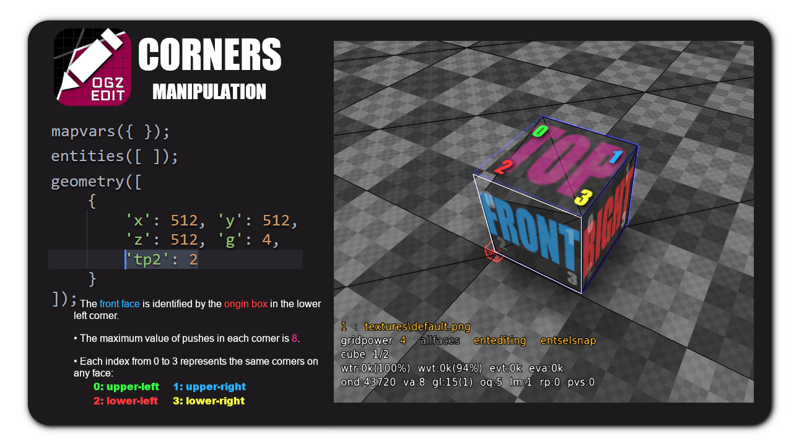

- [Map Variables](#map-variables)
- [Entities](#entities)
  - [Entity Types](#entity-types)
  - [Entity Attributes](#entity-attributes)
- [Geometry Properties](#geometry-properties)
  - [Position & Size](#position--size)
  - [Textures](#textures)
  - [Face Edge Push/Pull Properties](#face-edge-pushpull-properties)
- [Vslots Commands](#vslots-commands)

### Map Variables
All mapvars are supported, you can even come up with new ones (although loaded, they will not have any effect in-game).

Mapvars values ​​have a different format depending on their type:
- string: simply put it in double quotes, like `maptitle: "abc"`.
- color: put it in an array, like `skyboxcolour: [200, 100, 200]`.
- integer/float: numbers can be set directly, like `fog: 1000`.

`mapsize`: This is a special mapvar that is read-only in-game but can be modified in the formatter. It is essential for enabling geometry that requires a larger map. The formatter may attempt to automatically adjust the mapsize if geometry is placed outside the map bounds. However, the recommended practice is to set it manually. The value of mapsize must be a power of 2 (e.g., 512, 1024, 2048...) and is capped at 65536, which corresponds to a map scale of 16.

### Entities
- `x`: Sets entity X position.
- `y`: Sets entity Y position.
- `z`: Sets entity Z position.
- `t`: Sets entity type.

The available entity types are:

| Index | Entity Type     |l| Index | Entity Type     |l| Index | Entity Type     |
|-------|-----------------|-|-------|-----------------|-|-------|-----------------|
| 0     | none?           |l| 11    | riflerounds     |l| 21    | monster         |
| 1     | light           |l| 12    | grenades        |l| 22    | carrot          |
| 2     | mapmodel        |l| 13    | cartridges      |l| 23    | jumppad         |
| 3     | playerstart     |l| 14    | health          |l| 24    | base            |
| 4     | envmap          |l| 15    | healthboost     |l| 25    | respawnpoint    |
| 5     | particles       |l| 16    | greenarmour     |l| 26    | box             |
| 6     | sound           |l| 17    | yellowarmour    |l| 27    | barrel          |
| 7     | spotlight       |l| 18    | quaddamage      |l| 28    | platform        |
| 8     | shells          |l| 19    | teleport        |l| 29    | elevator        |
| 9     | bullets         |l| 20    | teledest        |l| 30    | flag            |
| 10    | rockets         |l| 21    | monster         |l|       |                 |
- `at0`: Sets first attribute of entity.
- `at1`: Sets second attribute of entity.
- `at2`: Sets third attribute of entity.
- `at3`: Sets fourth attribute of entity.
- `at4`: Sets fifth attribute of entity.

The engine loads a maximum of 10.000 entities. Some entities (like particles) accept colors as an attribute. Example:
```json
// adds a magenta colored fire particle
{x: 512, y: 512, z: 512, t: 5, at3: [255, 0, 255]}
```

### Geometry Properties
#### Position & Size
- `x`: Sets geometry X position.
- `y`: Sets geometry Y position.
- `z`: Sets geometry Z position.
- `g`: Sets geometry size ( 0 = 1x1, 1 = 2x2, 3 = 4x4... ).
- `t`: Sets geometry type.

    Leave undefined for default behavior or force an empty geometry by setting `t` to 1.

#### Textures
Textures are defined using the face identifier and an index corresponding to registered textures. Example:
```json
// adds a cube with size 32x32 and white texture (assuming default registered textures)
{x: 512, y: 512, z: 512, g: 5, af: 1462}
```
- `af`: Sets texture for all faces.
- `ft`: Sets texture for front face.
- `bk`: Sets texture for back face.
- `lf`: Sets texture for left face.
- `rt`: Sets texture for right face.
- `tp`: Sets texture for top face.
- `dn`: Sets texture for down face.

#### Face Edge Push/Pull Properties
Corners can be pushed a total of 8 times, without intersecting the corner on the opposite side.

Currently the formatter does not automatically adjust corners to prevent intersections. For instance, if the top-left corner of the front face has a push value of 6, and the top-right corner of the back face has a push value of 3, the resulting geometry will be invalid because their combined push value is 9.

| Face  | Top-left | Top-right | Bottom-left | Bottom-right |
|-------|----------|-----------|-------------|--------------|
| Front | ft0      | ft1       | ft2         | ft3          |
| Back  | bk0      | bk1       | bk2         | bk3          |
| Left  | lf0      | lf1       | lf2         | lf3          |
| Right | rt0      | rt1       | rt2         | rt3          |
| Top   | tp0      | tp1       | tp2         | tp3          |
| Down  | dn0      | dn1       | dn2         | dn3          |



#### Vslots commands
Currently the formatter will take any given texture as a base and apply the modified vslot index to an `af`, which means that for now it is only possible to apply vcommands to individual faces by setting the indexes manually to link them to the modified slot indexes.
```json
// adds two 32x32 cubes, the first one adds a custom vslot color with base texture 1462, the second one uses the same created slot (1704) on a different face (assuming the default registered textures length is 1703).
[
    {x: 512, y: 512, z: 512, g: 5, af: 1462, vcolor: [255, 0, 255]},
    {x: 512, y: 512, z: 544, g: 5, ft: 1704},
]
```

- `vshaderparam`: Specifies the x y z w values of a shader uniform parameter by its name. This enables the customization of properties for the same shader applied to different texture slots. Example: `vshaderparam: ["glowcolor", 255, 0, 255, 0]`.

    Uniform parameters are defined beforehand using the `defuniformparameter` command prior to a shader command.

- `vscale`: Sets the scale of a texture. Example: `vscale: 0.01`.

- `vcolor`: Colorize a texture with given normalized RGB values. Example: `vcolor: [1, 0.5, 0.2]`.

- `vrotate`: Rotates a texture. Example: `vrotate: 1`.

- `vlayer`: Sets the bottom texture layer for texture, it is used in blendpaint to blend textures. Example: `vlayer: 1462`.

- `voffset`: Offsets texture by X and Y values. Example: `voffset: [0.5, 0.1]`.
- `vscroll`: Adds a scroll animation to the texture in the X and Y direction. Example: `vscroll: [0.005, 0.001]`.
- `valpha`: Sets the transparency of the outer and inner view of a texture. Example: `valpha: [0.05, 1]`.


[<- Back to main README.md](README.md)