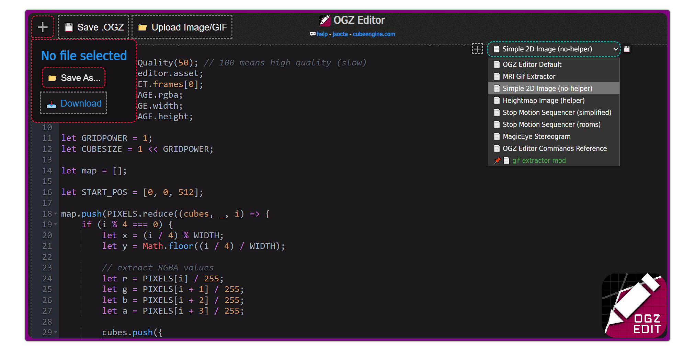

# OGZ Editor
A browser tool for writing [Sauerbraten](http://sauerbraten.org/) .ogz files (maps) using JavaScript.<br>
https://salatielsauer.github.io/OGZ-Editor/



- [OGZ Editor](#ogz-editor)
	- [Map Variables](#map-variables)
	- [Entities](#entities)
	- [Geometry](#geometry)
	- [VSlots](#vslot-commands)

- [JSOCTA](#jsocta)
	- [OctaMap](#octamap-class-methods)
  - [Browser Example](#browser-pakogzip)

## Updates (22/12/2024)

- OGZ Editor now supports running JavaScript directly.
- VSlot commands are now supported ([VSlots >](#vslot-commands)).
- Negative entity attribute values ​​work properly.
- A bunch of handy functions have been added ([`ogzeditor.` Helpers >](#ogz-editor-helpers)).
- Available functions are displayed for auto-completion when typing them with the `ogzeditor.` prefix.
- Presets can be saved to the browser cache or downloaded locally.
- A bunch of script presets are available ([Script Presets >](https://github.com/SalatielSauer/OGZ-Editor/tree/master/scripts/examples)).
- The previous home-made editor has been replaced by a more efficient one.
- OGZ Editor now allows you to upload assets (images/gifs) and use their data as input for JSOCTA.


<hr>

## Map Variables
To apply mapvars you can use the `mapvars({})` function. Pay special attention to their types, strings must be enclosed in double quotes and RGB colors must be defined as arrays.
```js
mapvars({
	"maptitle": "a beautiful map",
	"atmo": 1,
	"cloudlayer": "skyboxes/clouds01",
	"cloudfade": 0.9,
	"cloudscrollx": 0.01,
	"sunlight": [255, 100, 255]
})
```

## Entities
Entities can be added by passing an array parameter to the `entities([])` function.
```js
entities([
	{"x": 512, "y": 512, "z": 512, "t": 2, "at1": 23}
])
```
or by returning the value from the function:
```js
entities(() => {
  let ents = [
    {"x": 512, "y": 512, "z": 512, "t": 2, "at1": 23}
  ];

  return ents;
})
```
This will add a single entity of type 2 ("mapmodel") with attribute 1 set to 23 (carrot) at position 512 512 512.

The list of available entity properties are: `x y z t at0 at1 at2 at3 at4`, the [list of available types can be found here](https://github.com/SalatielSauer/OGZ-Editor/blob/master/scripts/mini-jsocta.js#L15).

## Geometry
Geometries can be added by defining cubes objects within an array passed to the `geometry([])` function.
```js
geometry([
	{"g": 5, "x": 512, "y": 512, "z": 512, "ft1": 5, "af": 2}
])
```
or by returning the value from the function:
```js
geometry(() => {
  let cubes = [
    {"g": 5, "x": 512, "y": 512, "z": 512, "ft1": 5, "af": 2}
  ];

  return cubes;
})
```

This will add a grass cube of gridpower 5 (`g`) with the upper-right corner of the front face (`ft1`) pushed 5 times.<br>
Some of the available properties for cubes are: `g t af tp bk lf rt dn ...`.<br>

`g` defines the cube gridpower/size (0 = 1x1, 1 = 2x2, 2 = 4x4...);<br>
`t` defines the cube type (1 "solid" by default);<br>
`af` determine the texture index for all faces;<br>
`tp` and all subsequent properties determine the texture index for that face;<br>
faces can be followed by a corner index from 0 to 3, which determine its push level.

The order of the corners are: (0)upper-left (1)upper-right (2)lower-left (3)lower-right.<br>

Each corner can be pushed a total of 8 times, 0 means no push.

As a reference, you can find the front face (ft) when the origin box is in the lower left corner of the selection.

## Vslot Commands
Vslots are responsible for manipulating texture properties (colors, shaders, etc).
Vslots can be set directly on the cube object:
```js
geometry(() => {
  let cube = {'g': 5, 'x': 512, 'y': 512, 'z': 512, 'af': 1462, 'vcolor': [1, 0, 0.5]};
  return cube;
})
```
The list of available vslots are:
- vshaderparam
- vscale
- vrotate
- voffset
- vscroll
- vlayer
- valpha
- vcolor

For vslots to take effect the geometry must have at least one texture.

## OGZ Editor Helpers
To make it easier to generate some structures, there are some predefined functions that can be accessed by typing `ogzeditor.`:

- `ogzeditor.ground(texture);`

  Adds a 4x4 flat plane to the map.

- `ogzeditor.cube(positionX, positionY, positionZ, texture, gridpower, vcolor);`

  Adds a cube to a given position.

- `ogzeditor.sphere(centerX, centerY, centerZ, gridpower, texture, radius, segments, rings);`

  Adds a sphere to a given position.

- `ogzeditor.text(text, startX, startY, startZ, texture, gridpower, rotate)`

  Adds a text to a given position.

- `ogzeditor.loopmap(worldSize, gridpower, callback);`

  Loops over every position with a given gridpower, returns x y z values as callback.

- `ogzeditor.image(assetID, quality, startX, startY, startZ, gridpower, yaw, layout, direction, heightmap);`

  Adds one or more flat images with optional heightmap support; requires uploading a file using the Upload button.

- `ogzeditor.cubeRoom(center, size, gridpower, texture, vcolor);`

  Adds an empty room.

- `ogzeditor.assets`

  Returns data of uploaded assets.
  - `ogzeditor.assets.frames`

    Returns an array containing objects with `.rgba`, `.width` and `.height` properties. Each object is either a GIF frame or an uploaded image.

- `ogzeditor.assetQuality(quality)`

    Sets the quality for image assets, 5 = lowest quality, 100 = highest quality (slower).

<hr>

# JSOCTA
JSOCTA is what powers the OGZ Editor, it consists of classes with methods that read, format and convert the contents of a JavaScript object into a valid OGZ.

You can easily install [**mini-jsocta.js**](https://raw.githubusercontent.com/SalatielSauer/OGZ-Editor/master/scripts/mini-jsocta.js) on your own page with the script tag:<br>
```html
<script src="mini-jsocta.js"></script>
```

### OctaMap class methods
- `.get_string()`
Converts and returns all items as a concatenated string.
- `.get_byte_array()`
Converts, concatenates and returns all items as a byte array.
- `.format_mapvars()`
Handles the formatting and conversion of map variables object.
- `.format_entities()`
Handles the formatting and conversion of the map entities array.
- `.format_geometry()`
Handles the formatting and conversion of the map octree array.
- `.format_vslots()`
Handles the formatting and conversion of the textures array (requires .format_geometry() to be ready).


#### Browser [pako.gzip](https://github.com/nodeca/pako)
```html
<head>
	<script src="https://cdnjs.cloudflare.com/ajax/libs/pako/2.0.3/pako.min.js"></script>
	<script src="scripts/mini-jsocta.js"></script>
</head>
<body>
	<script>
		console.log(
			pako.gzip(
				new OctaMap({
					"mapvars": {"maptitle": "map generated with the browser"},
					"geometry": [{'x': 512, 'y': 512, 'z': 512, 'af': 1462}]
				}).get_byte_array()
			)
		)
	</script>
</body>
```

<hr>

#### JSOCTA <br>
- [x] Support mapversion 33
- [ ] Read and convert octa to .json
- [x] Process and convert .json to octa
	###### Mapvars
	- [x] Integer, Float and String mapvars
	- [x] Convert RGB array to decimal
	###### Entities
	- [x] Support all entities
	- [x] Support multiple entities of the same type
	- [x] Support negative values of entity attributes
	###### Octree
	- [x] Support cube insertion at a specific coordinate and size
	- [ ] Support for copying and pasting geometry chunks
	- [x] Complex shapes (edges/corners editing)
	- [ ] Materials (alpha, clip, death, gameclip, lava, noclip, water)
	- [x] Virtual Slots (vshaderparam, vcolor, vscroll, vscale, valpha, voffset, vrotate)
	- [ ] Lightmaps
	- [ ] Blendmaps

#### OGZ Editor
- [x] Display auto-complete menu for predefined functions
- [x] Allow uploading assets (images/gif) and extracting their data
- [x] Presets environment to allow saving and loading script easily

<hr>

If you are interested in knowing [How VSlots are indexed in the OGZ file](https://docs.google.com/document/u/1/d/e/2PACX-1vSIOyX-SMcNvJpXFJdBup7jaJQ5YxVhUY5T5MRVQSu_ngAmnHtb23h6Y6Fxta9JNJJUQSbrKkGraDZT/pub) <-

OGZ Editor & JSOCTA by Salatiel S.<br>
Special thanks to [James Stanley](https://incoherency.co.uk/blog/) (@jes) for his very helpful [**documentation**](http://web.archive.org/web/20201112035903/https://incoherency.co.uk/interest/sauer_map.html) regarding version 29 of the Sauerbraten map format.